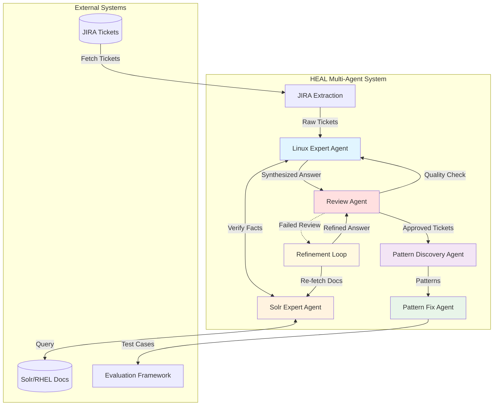
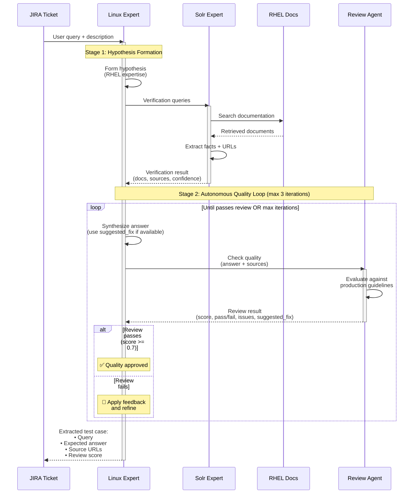
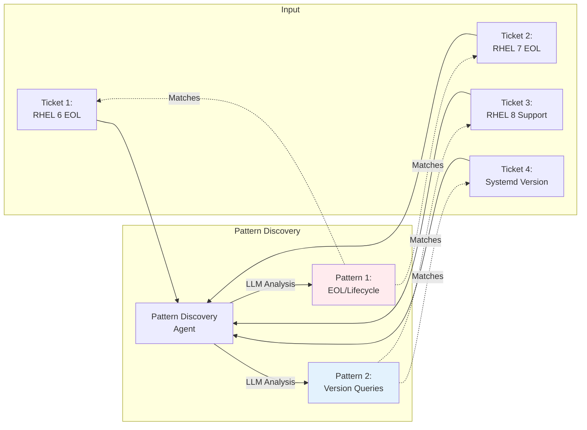
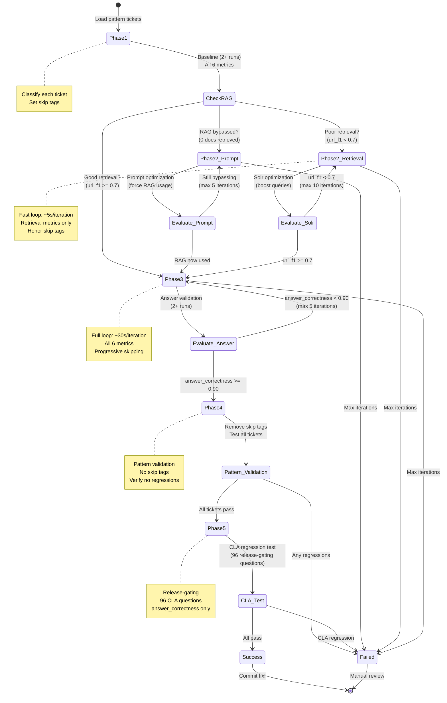
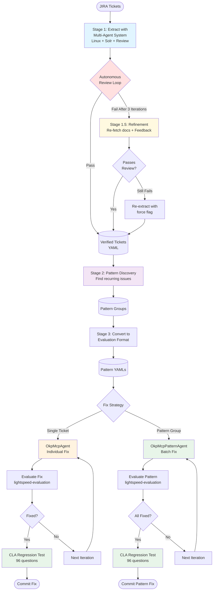

# HEAL: Heuristic Engine for Autonomous Labor

**HEAL** is an autonomous multi-agent system for diagnosing and fixing RAG (Retrieval-Augmented Generation) issues in AI applications. It uses specialized agents to analyze JIRA tickets, discover patterns, and automatically generate test cases with verified answers grounded in documentation.

[](https://www.python.org/downloads/)
[](https://github.com/psf/black)

---

## 🚀 Quickstart

### Get up and running in 3 steps:

```bash
# 1. Install dependencies
uv sync --extra dev

## NOTE: this is where the Claude code set up suggestion goes

# 2. Set up environment
cp .env.example .env
# if you have not set up a claude code account, do so before completing this step -

# Edit .env and add your ANTHROPIC_VERTEX_PROJECT_ID    # claude api chosen over pydantic-ai for vertex support, assumes vertex

# Then authenticate with Google Cloud (one-time setup):
#gcloud auth application-default login      # this is done in setting up claude account
```

### Bootstrap Workflow: Discovery & Pattern Generation

Full 3-stage pipeline for discovering patterns and generating evaluation configs:

#### Stage 1: Extract Tickets from JIRA

This is the ticket extraction initial step that uses jql and the Jira REST API along
with the Linux and Solr specialist agents. The result of this step is a yaml file with 
all tickets applying to the filter.


```bash
# Extract tickets with multi-agent verification (Linux Expert + Solr Expert)
uv run python src/heal/bootstrap/extract_jira_tickets.py \
    --jql "project = RSPEED AND labels = cla-incorrect-answer AND resolution = Unresolved" \
    --output config/extracted_tickets.yaml

# Or extract specific tickets:
uv run python src/heal/bootstrap/extract_jira_tickets.py \
    --tickets RSPEED-2651,RSPEED-2652,RSPEED-2653 \
    --output config/extracted_tickets.yaml

# Force re-extract (update existing tickets with new prompts):
uv run python src/heal/bootstrap/extract_jira_tickets.py \
    --tickets RSPEED-2651,RSPEED-2652 \
    --force-reextract
```

**Output:** `config/extracted_tickets.yaml` - extracted Q&A pairs with sources

#### Stage 1.5: Review Answer Quality (Optional) <-- shall not be optional, now baked in>

Validation of step one is important, as it involves autonomous agentic work. Make sure
the answer quality conforms to the production standards expected for the RHEL CLA 
response.


```bash
# Review extracted answers against production quality guidelines
uv run python src/heal/bootstrap/review_extracted_tickets.py \
    --input config/extracted_tickets.yaml \
    --report review_report.json

# Auto-fix issues if found:
uv run python src/heal/bootstrap/review_extracted_tickets.py \
    --input config/extracted_tickets.yaml \
    --auto-fix \
    --output config/extracted_tickets_fixed.yaml
```

**Checks:** Conciseness, no "based on documentation" phrases, complete commands, proper formatting

#### Stage 2: Discover Patterns
```bash
# Analyze extracted tickets to discover common patterns
uv run python src/heal/pattern_discovery/discover_ticket_patterns.py \
    --input config/extracted_tickets.yaml \
    --output-tagged config/tickets_with_patterns.yaml \
    --output-report config/patterns_report.json \
    --min-pattern-size 3
```

**Output:** Pattern groups with ≥3 similar tickets (e.g., EOL_RHEL_VERSION_SUPPORT, AUTHENTICATION_SECURITY)

#### Stage 3: Convert to Evaluation Format
```bash
# Generate one YAML per pattern for lightspeed-evaluation
uv run python src/heal/bootstrap/convert_bootstrap_to_eval_format.py \
    --tickets config/extracted_tickets.yaml \
    --patterns config/patterns_report.json \
    --tagged config/tickets_with_patterns.yaml \
    --output-dir config/patterns/
```

**Output:** Pattern-specific YAML files in `config/patterns/` ready for evaluation and pattern fix workflow.

---

**Result:** Automatically extracted test cases with:
- ✅ User query from ticket
- ✅ Expected answer verified against RHEL documentation  
- ✅ Source URLs from authoritative docs
- ✅ Confidence scores and reasoning

---

## ✨ Key Features

### 🎯 Smart RAG Bypass Detection
HEAL automatically detects when the LLM bypasses RAG (answers from general knowledge):
- **Zero docs retrieved:** LLM didn't use tools → routes to prompt optimization
- **Docs retrieved but ignored:** LLM used tools but ignored results → routes to prompt optimization
- **Wrong docs retrieved:** LLM used tools, got irrelevant docs → routes to Solr optimization

This intelligent routing prevents wasted iterations and ensures the right fix strategy.

### 🔄 Adaptive Iteration Strategy
Different problem types need different iteration speeds:
- **Retrieval problems:** Fast iteration (~5s) with retrieval-only metrics (no LLM answer generation)
- **Answer problems:** Full iteration (~30s) with all 6 metrics including LLM evaluation
- **Stability validation:** Multiple runs to detect variance and ensure consistent fixes

### 📊 Comprehensive Stability Analysis
HEAL runs multiple evaluations to detect intermittent issues:
- **High variance detection:** Identifies metrics with >15% std deviation
- **Temporal validity issues:** Catches problems that occur inconsistently (e.g., RSPEED-2200 pattern)
- **Safe-to-fix classification:** Only applies automated fixes to stable, reproducible problems

### 🛡️ Release-Gating Validation
Every pattern fix goes through CLA regression testing:
- **96 command-line assistant questions** (release-gating test suite)
- **Prevents regressions:** Ensures fixes don't break existing functionality
- **Answer-focused:** Uses `--metrics custom:answer_correctness` (CLA often bypasses RAG)

### 🎨 Answer-First Ground Truth
Unlike traditional approaches that guess answers, HEAL verifies against documentation:
- **Hypothesis formation:** Linux Expert forms answer based on RHEL knowledge
- **Solr verification:** Searches actual documentation to verify hypothesis
- **Confidence scoring:** HIGH/MEDIUM/LOW based on verification quality
- **Source tracking:** Every answer includes source URLs for traceability

---

## 📊 Architecture Overview

HEAL uses a multi-agent architecture with specialized agents for different tasks:



---

## 🔄 Agent Workflows

### 1. Answer-First Extraction Workflow

HEAL uses an innovative **answer-first** approach: instead of guessing answers from training data, it verifies facts against actual documentation.



**Why This Works:**
- 🎯 **Grounded in Reality:** Answers come from actual docs, not LLM training data
- 📚 **Traceable Sources:** Every answer includes source URLs
- 🔍 **Lower Hallucination:** Facts verified against authoritative documentation
- 📈 **Higher Extraction Rate:** 96%+ vs 21% with traditional prompting

---

### 2. Pattern Discovery Workflow

HEAL discovers recurring patterns across tickets to enable batch fixing (10-15x efficiency gain):



**Pattern Types Discovered:**
- 🔴 **EOL/Lifecycle queries** - End-of-life and support lifecycle questions
- 🔵 **Version compatibility** - "Can I run X on Y?" questions
- 🟢 **Feature availability** - "Does RHEL X support Y?" questions
- 🟡 **Configuration issues** - Authentication, networking, container config

---

### 4. Four-Phase Fix Workflow

HEAL uses a smart 4-phase workflow that adapts based on the type of problem detected:

#### Phase 1: Baseline Assessment (with Stability)
- Run full evaluation with all 6 metrics (multiple runs for stability)
- Detect RAG bypass (zero documents retrieved)
- Classify problem type: retrieval vs answer quality issue
- Identify high-variance metrics (indicates instability)

**Output:** Problem classification and baseline metrics for comparison

#### Phase 2: Smart Optimization Routing
Based on Phase 1 classification, routes to appropriate fix strategy:

**2A. RAG Bypassed → Prompt Optimization**
- LLM answered from general knowledge (0 docs retrieved)
- Optimize system prompt to force tool usage
- Fast iteration with full metrics

**2B. Poor Retrieval → Solr Optimization**
- Documents retrieved but wrong ones (url_f1 < 0.7)
- Optimize Solr boost queries and filters
- Fast iteration with retrieval-only metrics (no LLM answer generation)

**2C. Good Retrieval, Bad Answer → Prompt Optimization**
- Right docs retrieved (url_f1 >= 0.7) but LLM not using them
- Optimize prompts to improve document utilization
- Full metrics evaluation

#### Phase 3: Answer Validation (with Stability)
- Run full evaluation with all 6 metrics (multiple runs)
- Verify answer_correctness >= 0.90 (stricter than baseline 0.75)
- Check stability across runs (low variance required)

**Success Criteria:**
- ✅ Answer correctness >= 0.90
- ✅ Stable across multiple runs (variance < 15%)
- ✅ All 6 metrics meet thresholds

#### Phase 4: Final Pattern Validation
- Remove ALL skip tags from pattern tickets
- Run full evaluation with all 6 metrics
- Verify all pattern tickets still pass (no regressions)
- Check that previously-passing tickets remain stable

**Success Criteria:**
- ✅ All pattern tickets pass threshold
- ✅ No regressions in previously-stable tickets
- ✅ Low variance across runs (stable fixes)

#### Phase 5: CLA Regression Test (Release-Gating)
- Run 96 release-gating questions (command-line assistant test suite)
- Filter to `custom:answer_correctness` only (CLA often bypasses RAG)
- Verify no regressions introduced by the fix

**Success Criteria:**
- ✅ All 96 CLA questions pass
- ✅ No new failures introduced  
- ✅ Pattern fix doesn't break existing functionality

**Result:** Safe to merge - pattern fix validated, stable, and regression-tested

---

### 3. Pattern Fix Loop

Once patterns are identified, HEAL can fix entire groups of similar issues through a 4-phase workflow:



---

## 🏗️ Agent Architecture

### Core Agents

| Agent | Purpose | Input | Output |
|-------|---------|-------|--------|
| **Linux Expert** | Forms hypotheses using RHEL expertise | JIRA ticket | Hypothesis + verification queries |
| **Solr Expert** | Searches docs and verifies facts | Verification queries | Facts + source URLs + confidence |
| **Pattern Discovery** | Finds recurring patterns | Extracted tickets | Pattern groups |
| **OkpMcpAgent** | Diagnoses & fixes single tickets | Ticket ID | Fix suggestions |
| **OkpMcpPatternAgent** | Batch-fixes pattern groups | Pattern ID | Fixed pattern |

### Data Flow



---

## 📦 Installation

### Prerequisites

- Python 3.11+
- `uv` package manager (recommended) or `pip`
- Google Cloud credentials (for Claude API via Vertex AI)
- Access to Solr instance with RHEL documentation

### Setup

```bash
# Clone the repository
git clone https://github.com/your-org/HEAL.git
cd HEAL

# Install dependencies
uv sync --extra dev

# Set up environment variables
cp .env.example .env
# Edit .env and fill in your values:
#   ANTHROPIC_VERTEX_PROJECT_ID=your-project-id
#   SOLR_URL=http://localhost:8983/solr/portal  # Optional

# Authenticate with Google Cloud (one-time setup)
gcloud auth application-default login

# Verify installation
uv run python -c "from heal.core.linux_expert import LinuxExpertAgent; print('✅ HEAL installed successfully')"
```

---

## 💻 Usage

### Extract JIRA Tickets

Extract tickets with verified answers from JIRA:

```bash
# Default query: RSPEED incorrect-answer tickets
uv run python -m heal.bootstrap.extract_jira_tickets \
    --output config/extracted_tickets.yaml

# Custom JQL query
uv run python -m heal.bootstrap.extract_jira_tickets \
    --jql "project = RSPEED AND status = Open" \
    --output config/open_tickets.yaml

# Process specific tickets
uv run python -m heal.bootstrap.extract_jira_tickets \
    --tickets RSPEED-2482,RSPEED-2511 \
    --output config/specific_tickets.yaml
```

**Output Format:**
```yaml
- ticket_key: RSPEED-2482
  query: "Can I run RHEL 6 containers on RHEL 9?"
  expected_response: "RHEL 6 reached end-of-life on November 30, 2020..."
  expected_urls:
    - "access.redhat.com/rhel6-eol"
    - "access.redhat.com/support/policy/updates/errata"
  confidence: HIGH
  inferred: false
  sources:
    - title: "Red Hat Enterprise Linux 6 - End of Life"
      url: "access.redhat.com/rhel6-eol"
```

### Discover Patterns

Analyze extracted tickets to find recurring patterns:

```bash
uv run python -m heal.pattern_discovery.discover_ticket_patterns \
    --input config/extracted_tickets.yaml \
    --output config/patterns_report.json \
    --min-tickets 3
```

**Output:** Patterns with matched tickets grouped by similarity.

### Fix Single Ticket

Diagnose and fix a single ticket:

```bash
uv run python -m heal.agents.okp_mcp_agent diagnose RSPEED-2482

# Auto-fix with iterations
uv run python -m heal.agents.okp_mcp_agent fix RSPEED-2482 \
    --max-iterations 10
```

### Fix Pattern Group (Batch)

Fix an entire pattern at once (10-15x faster):

```bash
# Simple wrapper (recommended) - uses sensible defaults
./scripts/run_pattern_fix.sh CONTAINER_UNSUPPORTED_CONFIG           # full-pattern mode (default)
./scripts/run_pattern_fix.sh RHEL10_DEPRECATED_FEATURES single      # single-ticket mode

# Direct command (for custom parameters)
uv run python src/heal/runners/run_pattern_fix_poc.py \
    CONTAINER_UNSUPPORTED_CONFIG \
    --mode single \
    --max-iterations 10 \
    --stability-runs 5

# Batch process all patterns
./scripts/run_all_pattern_fixes.sh \
    --mode full \
    --max-iterations 10 \
    --stability-runs 5
```

**Testing Modes:**
- `--mode single`: Test one representative ticket (fastest, for iteration)
- `--mode full`: Test all tickets in pattern (comprehensive, for validation)

**Phase Parameters:**
- `--max-iterations`: Max optimization iterations (default: 10)
- `--stability-runs`: Runs per stability check (default: 5)
- `--answer-threshold`: Answer correctness threshold (default: 0.90)

---

## 📖 Understanding Workflow Output

### Phase 1: Baseline Assessment
```
🔍 Running full baseline evaluation for ALL tickets in pattern (2 runs)...
   Metrics: url_retrieval, context_relevance, context_precision,
           answer_correctness, faithfulness, response_relevancy

================================================================================
DIAGNOSING: ALL TICKETS IN PATTERN
================================================================================
   Cleaned pattern config:
   - Ready for eval: 2 tickets
   - Need SME review: 0 tickets (empty expected_response)
   - Metrics in YAML: 6 (url_retrieval_eval, context_relevance, ...)
```

**What to look for:**
- ✅ **"Ready for eval: N tickets"** - Tickets with expected_response filled in
- ⚠️ **"Need SME review: N tickets"** - Quarantined to `*_SME_REVIEW.yaml` (empty expected_response)
- ✅ **"RAG Status: ✅ Used (5 docs)"** - LLM used retrieval, safe to optimize
- ⚠️ **"RAG Status: ❌ BYPASSED (0 docs)"** - Will route to prompt optimization
- ⚠️ **"HIGH VARIANCE DETECTED"** - Intermittent issue, may not be fixable

### Phase 2: Optimization
```
🔍 Problem Analysis:
   RAG Bypassed:      False
   Retrieval Problem: True
   Answer Problem:    False

→ Routing to: RETRIEVAL OPTIMIZATION (Solr changes)
   Fast iteration with retrieval-only metrics
```

**Optimization paths:**
- **RAG Bypassed** → Prompt optimization (force tool usage)
- **Retrieval Problem** → Solr optimization (boost queries, filters)
- **Answer Problem** → Prompt optimization (improve document utilization)

### Phase 3: Answer Validation
```
📊 Answer Validation Results:
   Runs:               2
   Answer Correctness: 0.92 ± 0.02
   Faithfulness:       0.88 ± 0.01
   Response Relevancy: 0.91 ± 0.03

✅ Answer validation PASSED (>= 0.90, stable variance)
```

**Success criteria:**
- ✅ Answer correctness >= 0.90 (stricter than baseline 0.75)
- ✅ Low variance across runs (< 15% std deviation)
- ✅ All 6 metrics meet thresholds

### Phase 4: CLA Regression
```
🧪 Running CLA regression test (96 release-gating questions)...
   Using --metrics custom:answer_correctness (CLA bypasses RAG)

✅ CLA regression test PASSED
   96/96 questions passed
   No regressions introduced
```

**What it validates:**
- ✅ No new failures in command-line assistant
- ✅ Pattern fix doesn't break existing functionality
- ✅ Safe to merge to main

---

## 🧪 Testing

Run the test suite:

```bash
# Run all tests
make test

# Run specific test categories
uv run pytest tests/test_imports.py -v  # Import tests
uv run pytest tests/test_multi_agent_system.py -v  # Agent tests

# With coverage
uv run pytest tests/ --cov=src --cov-report=html
```

**Test Coverage:**
- ✅ Import tests (8 tests)
- ✅ Multi-agent system (14 tests)
- ✅ JIRA extraction (integration tests)
- ✅ Pattern discovery
- 📊 Current: 80%+ coverage

---

## 🔧 Development

### Code Quality

Run quality checks before committing:

```bash
make format       # Format with black
make lint         # Lint with ruff
make type-check   # Type check with mypy
make test         # Run tests

# Or run all at once
make quality-checks
```

### Git Hooks

Pre-commit hooks are installed automatically:

```bash
make install-deps-test  # Installs hooks + dependencies
```

**Hooks run:**
- ✅ Code formatting (black)
- ✅ Linting (ruff, pylint)
- ✅ Type checking (mypy)
- ✅ Security scanning (bandit, detect-secrets)
- ✅ Docstring style (pydocstyle)

### Project Structure

```
HEAL/
├── src/heal/              # Main package
│   ├── agents/           # Agent implementations
│   │   ├── okp_mcp_agent.py          # Single ticket agent
│   │   ├── okp_mcp_pattern_agent.py  # Pattern batch agent
│   │   └── okp_mcp_llm_advisor.py    # AI-powered suggestions
│   ├── core/             # Core components
│   │   ├── linux_expert.py           # Linux expertise agent
│   │   ├── solr_expert.py            # Documentation search
│   │   ├── pattern_discovery.py      # Pattern detection
│   │   └── search_intelligence.py    # Search optimization
│   ├── bootstrap/        # JIRA ticket extraction
│   │   ├── extract_jira_tickets.py
│   │   └── multi_agent_jira_extractor.py
│   └── runners/          # CLI runners
├── tests/                # Test suite
├── config/               # Configuration files
├── docs/                 # Documentation
│   └── README.md         # API Guide
├── pyproject.toml        # Project configuration
└── Makefile              # Development commands
```

---

## 📚 Documentation

- **[API Guide](docs/README.md)** - Detailed API documentation for all agents
- **[AGENTS.md](docs/AGENTS.md)** - Guidelines for AI coding agents
- **[BEST_PRACTICES_TESTING.md](BEST_PRACTICES_TESTING.md)** - Testing best practices

---

## 🤝 Contributing

Contributions welcome! Please read [AGENTS.md](AGENTS.md) for:

- Coding standards (type hints, docstrings, error handling)
- Testing guidelines (pytest conventions, mocking)
- Quality requirements (formatting, linting, type checking)

**Before submitting:**

1. ✅ Read the source files (don't guess class names!)
2. ✅ Add tests for new functionality
3. ✅ Run `make quality-checks` and `make test`
4. ✅ Update documentation if needed

---

## 📊 Evaluation Metrics

HEAL uses 6 core metrics across 4 phases to ensure comprehensive quality:

**Retrieval Quality (Phases 1-2):**
- `custom:url_retrieval_eval` - F1 score of expected vs retrieved documentation URLs (threshold: 0.7)
- `ragas:context_relevance` - Relevance of retrieved context to user query (threshold: 0.7)
- `ragas:context_precision_without_reference` - Precision of retrieval without ground truth (threshold: 0.7)

**Answer Quality (Phases 1, 3):**
- `custom:answer_correctness` - Correctness vs expected answer using LLM evaluation (threshold: 0.90)
- `ragas:faithfulness` - How faithful the response is to retrieved context (threshold: 0.8)
- `ragas:response_relevancy` - How relevant the response is to the question (threshold: 0.8)

**Metrics Approach:**
- ✅ **Baseline:** All 6 metrics in YAML for comprehensive evaluation
- ✅ **Retrieval-only mode:** Use `--metrics` flag to filter to retrieval metrics (faster iteration)
- ✅ **CLA regression:** Use `--metrics custom:answer_correctness` to focus on answer quality only

**Deprecated metrics (kept as code artifacts):**
- ~~`custom:keywords_eval`~~ - Keyword matching (too strict)
- ~~`custom:forbidden_claims_eval`~~ - Known-incorrect claims (regression detection)

---

## 📊 Performance

**Extraction Rate:**
- Traditional prompting: ~21% of tickets successfully extracted
- HEAL multi-agent approach: **96%+ success rate**

**Pattern Fix Efficiency:**
- Single-ticket fixes: ~6 min/ticket, ~$0.22/ticket
- Pattern batch fixes: ~11 min/pattern (3-15 tickets), ~$0.21/pattern
- **10-15x efficiency gain** on grouped tickets

**Workflow Phases:**
- Phase 1 (Baseline): ~5 min with 5 stability runs (all 6 metrics)
- Phase 2 (Optimization): ~5-30s/iteration (retrieval-only or full metrics)
- Phase 3 (Answer Validation): ~2 min with 5 stability runs (all 6 metrics)
- Phase 4 (CLA Regression): ~10 min (96 release-gating questions, answer_correctness only)

**Cost Breakdown:**
- JIRA extraction: ~$0.02/ticket (with verification)
- Single fix: ~$0.22/ticket (diagnosis + iterations)
- Pattern fix: ~$0.21/pattern (amortized across tickets)

---

## 🛠️ Troubleshooting

### Import Errors

**Problem:** `ImportError: cannot import name 'ClassName'`

**Solution:**
```bash
# Check what's actually in the file
grep "^class " src/heal/path/to/file.py

# Or read the file
cat src/heal/path/to/file.py
```

### Authentication Issues

**Problem:** `ANTHROPIC_VERTEX_PROJECT_ID not set`

**Solution:**
```bash
# 1. Make sure .env file exists and has your project ID
cp .env.example .env
# Edit .env and set: ANTHROPIC_VERTEX_PROJECT_ID=your-project-id

# 2. Authenticate with Google Cloud (one-time setup)
gcloud auth application-default login
```

### Solr Connection

**Problem:** Solr queries failing

**Solution:**
```bash
# Check Solr is running
curl http://localhost:8983/solr/portal/select?q=*:*&rows=1

# Set custom URL in .env file
# Edit .env and add: SOLR_URL=http://your-solr-host:8983/solr/portal
```

### Pattern Fix Fails with "No metrics found"

**Problem:** Pattern fix workflow fails during baseline with no metrics

**Solution:**
```bash
# 1. Check that pattern YAML has expected_response filled in
cat config/patterns/YOUR_PATTERN.yaml

# 2. If tickets have empty expected_response, they'll be quarantined
# Review SME file: config/patterns/YOUR_PATTERN_SME_REVIEW.yaml

# 3. For full-pattern mode, at least 1 ticket needs expected_response
# Use single-ticket mode to iterate faster on one ticket
```

### Metrics Validation Errors

**Problem:** `Unknown turn metric 'ragas:faithfulness'`

**Solution:**
```bash
# Make sure config/system_okp_mcp_agent.yaml includes all 6 metrics:
grep -A 3 "ragas:faithfulness" config/system_okp_mcp_agent.yaml
grep -A 3 "ragas:response_relevancy" config/system_okp_mcp_agent.yaml

# If missing, they need to be added to metrics_metadata.turn_level section
```

---

## 📄 License

Apache-2.0

---

## 🙏 Acknowledgments

Built by the Red Hat Lightspeed Team with:
- **Claude Agent SDK** - Multi-agent orchestration
- **Pydantic** - Data validation
- **httpx** - Async HTTP for Solr queries
- **pytest** - Testing framework

---

**Questions?** Check [AGENTS.md](AGENTS.md) for detailed guidelines or file an issue.
